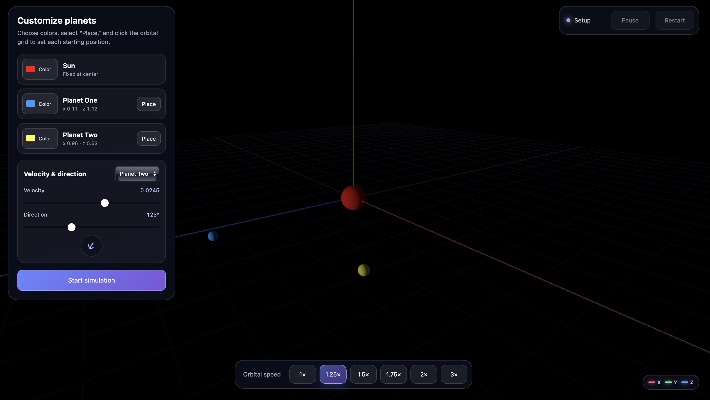
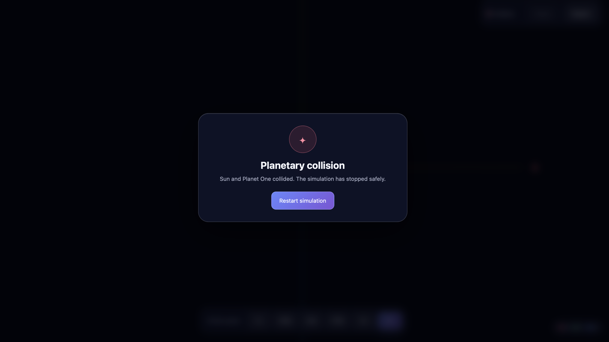

# 3D planetary simulation

An interactive 3D gravity simulator built with Three.js. User can experiment with planetary motion, orbital mechanics, and collision dynamics in real-time.

## Features

- **Customise planetary systems** :Adjust initial speed, position, and direction of planets before simulation begins.
- **Real-time controls** :Modify orbital speed on the fly during simulation.
- **Collision detection** :Planet impacts are detected and simulation stops.

---

---

## Tech Stack

